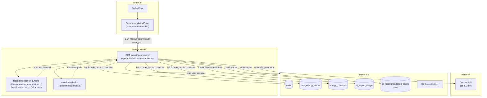

# Design Document — AI Energy Task Recommendation

## Overview

This feature extends VibeFocus's existing deterministic `rankTodayTasks` algorithm into a learning, AI-powered recommendation engine. The engine analyses a user's historical energy audit results (`task_energy_audits`) to score candidate tasks by how energising they have historically been, aligns those scores with the user's current energy check-in, and enriches each recommendation with an OpenAI-generated plain-language rationale.

The design is strictly additive: no existing tables, routes, or domain functions are changed. The new `Recommendation_Engine` is a pure function that accepts pre-fetched arrays; the `Recommendation_API` route handles all I/O; the `RecommendationPanel` component slots into the existing Today view without modifying `TodayView.tsx`.

### Key design goals

- **Privacy by construction** — the engine receives anonymised, pre-fetched data; it never queries the database or includes PII in OpenAI prompts.
- **Graceful degradation** — cold start, no API key, OpenAI timeout, and error states all produce valid, user-friendly output rather than errors.
- **Cost efficiency** — a 15-minute Supabase cache keyed on a content hash avoids redundant OpenAI calls.
- **Pattern consistency** — auth, rate limiting, and Supabase client usage mirror the existing `app/api/ai/import/route.ts` patterns exactly.

---

## Architecture



### Request flow

1. `RecommendationPanel` calls `GET /api/ai/recommend` (optional `?energy=low|medium|high`).
2. The route authenticates via the Supabase server client, derives `user_id` from the session.
3. It computes a `cache_key` hash and checks `ai_recommendation_cache`. On hit (< 15 min), it returns cached data with `X-Cache: HIT`.
4. On miss: fetch pending tasks, audit history, and the most recent energy check-in from Supabase in parallel.
5. If audit count < 3, delegate to `rankTodayTasks` (cold start path), return with `cold_start: true`.
6. Otherwise call `Recommendation_Engine` with the pre-fetched arrays to compute scored + ranked tasks.
7. Check rate limit (`ai_import_usage`). If under quota, call OpenAI for rationale strings (5 s timeout); otherwise generate rationale locally.
8. Write the result to `ai_recommendation_cache`, respond with `X-Cache: MISS`.

---

## Components and Interfaces

### 1. `lib/domain/recommendation.ts` — Recommendation_Engine

Pure function module. No imports from Supabase, Next.js, or OpenAI.

```typescript
import type { Task, RequiredEnergy, EnergyRating, Priority } from "./types"

export type ConfidenceLevel = "low" | "medium" | "high"

export interface AuditRecord {
  taskId: string
  category: string | null
  required_energy: RequiredEnergy | null
  priority: Priority
  rating: EnergyRating
  auditedAt: string          // ISO string — for recency weighting
}

export interface RecommendationInput {
  pendingTasks: Task[]
  auditHistory: AuditRecord[]
  currentEnergy: RequiredEnergy
  now?: Date                 // injectable for testing
}

export interface ScoredTask {
  task: Task
  score: number              // composite [0, ~200] before clamping
  affinityScore: number      // normalised [0, 100]
  energyAlignment: number    // raw alignment bonus/penalty
  priorityScore: number
  urgencyScore: number
  matchingAuditCount: number // used for confidence
  confidence: ConfidenceLevel
}

/** Scores and ranks pending tasks. Returns at most `limit` results (default 10). */
export function scoreAndRankTasks(
  input: RecommendationInput,
  limit = 10,
): ScoredTask[]

/** Computes the weighted affinity score for a single task given its matching audits. */
export function computeAffinityScore(
  matchingAudits: AuditRecord[],
  allAffinityScores: number[],  // for normalisation context
): number

/** Derives the current energy level from a raw 1–5 check-in level. */
export function resolveCurrentEnergy(level: number | null): RequiredEnergy

/** Builds the local fallback rationale string for a scored task. */
export function buildLocalRationale(scored: ScoredTask, currentEnergy: RequiredEnergy): string
```

**Scoring algorithm** (implemented inside `scoreAndRankTasks`):

```
For each pending task t:

  1. AFFINITY RAW SCORE
     matchingAudits = auditHistory where (audit.category == t.category
                                          OR audit.required_energy == t.required_energy
                                          OR audit.priority == t.priority)
     Partition into recent = most recent 20 of matchingAudits, older = rest
     rawScore = Σ weight(a) * rating_value(a.rating)  for a in matchingAudits
       where weight(a) = 1.5 if a in recent, else 1.0
       and rating_value = +2 (energizing) | 0 (neutral) | -1 (draining)
     If rawScore == 0 or matchingAudits.empty → affinityRaw = 0

  2. NORMALISE across all pending tasks
     minRaw = min(all rawScores); maxRaw = max(all rawScores)
     if maxRaw == minRaw → affinityNorm = 0 for all
     else affinityNorm = clamp((rawScore - minRaw) / (maxRaw - minRaw) * 100, 0, 100)

  3. ENERGY ALIGNMENT
     (currentEnergy=low,    required_energy=low)  → +30
     (currentEnergy=low,    required_energy=high) → -20
     (currentEnergy=medium, required_energy=medium) → +15
     (currentEnergy=high,   required_energy=high) → +30
     (currentEnergy=high,   required_energy=low)  → -10
     all other pairs → 0

  4. PRIORITY SCORE: low=10, medium=30, high=60

  5. URGENCY SCORE (hours = (due_at - now) / 3_600_000):
     hours < 0    → 100  (overdue)
     hours ≤ 24   → 70
     hours ≤ 72   → 30
     no due date  → 0

  6. COMPOSITE = 0.4*affinityNorm + 0.3*energyAlignment + 0.2*priorityScore + 0.1*urgencyScore
     Note: energyAlignment is not normalised before weighting; it is a signed adjustment
           in the same numeric space as other components.

  7. CONFIDENCE
     matchingAuditCount = |matchingAudits|
     ≥ 10 → "high"  |  3–9 → "medium"  |  < 3 → "low"

Sort by composite DESC, ties by created_at ASC. Return first `limit` tasks.
```

---

### 2. `app/api/ai/recommend/route.ts` — Recommendation_API

```typescript
// GET /api/ai/recommend?energy=low|medium|high
export async function GET(request: Request): Promise<Response>
```

Responsibilities:
- Authenticate via `createClient()` from `@/utils/supabase/server`.
- Parse and validate the optional `energy` query param (400 on invalid value).
- Compute `cache_key = sha256(sortedPendingTaskIds + "|" + energyLevel + "|" + auditCount)` using the Node.js `crypto` module.
- Check `ai_recommendation_cache`; return HIT if < 15 minutes old and `cache_key` matches.
- Fetch in parallel: `tasks` (status=pending), `task_energy_audits` (all for user), `energy_checkins` (most recent within 12 h).
- Resolve `currentEnergy` from the check-in (or default to `medium`). If a valid `energy` query param is provided AND a check-in exists within 12 h, use the param value.
- If audit count < 3: call `rankTodayTasks`, build response with `cold_start: true`, skip OpenAI.
- Otherwise: call `scoreAndRankTasks`, then attempt OpenAI rationale generation.
- Rate-limit OpenAI calls using the `ai_import_usage` table (same 60-minute rolling window, 10 calls max).
- On rate limit hit or no API key: generate rationale via `buildLocalRationale`.
- Write result to `ai_recommendation_cache` (upsert by `user_id`).
- Return JSON with `X-Cache: MISS`.

**Response schema:**

```typescript
interface RecommendationResponse {
  recommendations: {
    task: Task
    score: number
    confidence: ConfidenceLevel
    reason: string           // ≤ 120 characters
  }[]
  cold_start: boolean
  generated_at: string       // ISO 8601
}
```

**OpenAI prompt structure** (no PII, no IDs):

```
You are a productivity coach. Given the user's current energy level and their task history patterns,
provide a one-sentence reason (maximum 120 characters) for why each task is recommended.

Current energy: {low|medium|high}
Affinity by category: {category: avgRating, ...}  // anonymised category names only

Tasks (top 5):
1. Title: "{title}", Category: "{category}", Required energy: "{low|medium|high}", Priority: "{low|medium|high}"
2. ...

Return JSON: { "rationales": ["reason1", "reason2", ...] }
```

---

### 3. `components/features/RecommendationPanel.tsx` — UI Component

```typescript
"use client"
export function RecommendationPanel(): JSX.Element
```

State:
- `status: "idle" | "loading" | "loaded" | "error"`
- `data: RecommendationResponse | null`
- `hasCheckin: boolean` — derived from a lightweight `/api/analytics/summary` check or a dedicated field in the recommendation response.

Render states:

| State | UI |
|---|---|
| No energy check-in today | Prompt card: "Log your energy to unlock personalised recommendations" with link to energy selector |
| Loading | 3 × `<Skeleton>` cards |
| `cold_start: true` | Info card: "Building your energy profile — complete more tasks to unlock personalised suggestions." |
| Loaded | Top 3 `RecommendationCard` components |
| Error | Inline muted error message; does not unmount sibling sections |

`RecommendationCard` props:
```typescript
{ task: Task; score: number; confidence: ConfidenceLevel; reason: string; onFocus: () => void }
```

On card click/tap: calls `setActiveTaskId(task.id)` from `useVibe()` then navigates to `/dashboard/focus`, consistent with the existing Today view task interaction pattern.

**Cache invalidation hook**: after `auditTask` succeeds in `VibeContext`, call `fetch('/api/ai/recommend/invalidate', { method: 'POST' })` — or, more simply, the `Recommendation_API` route can check the `task_energy_audits` count change via the `cache_key` hash on the next load (the audit count is embedded in the cache key, so a new audit automatically produces a key mismatch and triggers recomputation). No separate invalidation endpoint is required.

---

### 4. `supabase/migrations/YYYYMMDDNNNN_ai_recommendation_cache.sql` — New Migration

```sql
create table if not exists public.ai_recommendation_cache (
  user_id        uuid primary key references auth.users(id) on delete cascade,
  cache_key      text not null,
  payload        jsonb not null,
  generated_at   timestamptz not null default timezone('utc', now()),
  updated_at     timestamptz not null default timezone('utc', now())
);

alter table public.ai_recommendation_cache enable row level security;

create policy "ai_recommendation_cache_select_own"
  on public.ai_recommendation_cache for select
  to authenticated using (auth.uid() = user_id);

create policy "ai_recommendation_cache_insert_own"
  on public.ai_recommendation_cache for insert
  to authenticated with check (auth.uid() = user_id);

create policy "ai_recommendation_cache_update_own"
  on public.ai_recommendation_cache for update
  to authenticated using (auth.uid() = user_id)
  with check (auth.uid() = user_id);

create policy "ai_recommendation_cache_delete_own"
  on public.ai_recommendation_cache for delete
  to authenticated using (auth.uid() = user_id);

revoke all on table public.ai_recommendation_cache from public, anon, authenticated;
grant select, insert, update, delete on table public.ai_recommendation_cache to authenticated;

drop trigger if exists ai_recommendation_cache_set_updated_at
  on public.ai_recommendation_cache;
create trigger ai_recommendation_cache_set_updated_at
  before update on public.ai_recommendation_cache
  for each row execute function public.set_updated_at();

create index if not exists ai_recommendation_cache_generated_at_idx
  on public.ai_recommendation_cache(generated_at desc);
```

Cache invalidation on audit submission is handled automatically: the `cache_key` encodes the audit record count, so any new audit produces a hash mismatch on the next request, which triggers recomputation. Explicit row deletion is also triggered by the API route after a successful audit (via the `auditTask` path in `VibeContext` calling `DELETE /api/ai/recommend/cache`).

---

## Data Models

### Existing tables consumed (read-only)

| Table | Columns used |
|---|---|
| `tasks` | `id, title, category, required_energy, priority, due_at, status, created_at` |
| `task_energy_audits` | `task_id, user_id, rating, audited_at` |
| `energy_checkins` | `user_id, level, checked_at` |
| `ai_import_usage` | `user_id, window_started_at, request_count` |

### New table

**`ai_recommendation_cache`**

| Column | Type | Notes |
|---|---|---|
| `user_id` | `uuid` PK | FK → `auth.users`, cascade delete |
| `cache_key` | `text` | SHA-256 hex of `taskIds\|energy\|auditCount` |
| `payload` | `jsonb` | Full `RecommendationResponse` object |
| `generated_at` | `timestamptz` | When the cache entry was written |
| `updated_at` | `timestamptz` | Auto-updated by trigger |

### TypeScript types (additions to `lib/domain/types.ts`)

```typescript
export type ConfidenceLevel = "low" | "medium" | "high"

export interface Recommendation {
  task: Task
  score: number
  confidence: ConfidenceLevel
  reason: string
}

export interface RecommendationResponse {
  recommendations: Recommendation[]
  cold_start: boolean
  generated_at: string
}
```

---

## Correctness Properties

*A property is a characteristic or behavior that should hold true across all valid executions of a system — essentially, a formal statement about what the system should do. Properties serve as the bridge between human-readable specifications and machine-verifiable correctness guarantees.*

The `Recommendation_Engine` is a pure function operating over in-memory arrays, making it an ideal candidate for property-based testing. The following properties are derived from the prework analysis above.

---

### Property 1: Affinity score correctly aggregates weighted ratings

*For any* pending task and any audit history, the raw affinity score computed by the engine must equal the sum of weighted rating values — `+2 × 1.5` for recent-energising, `+2 × 1.0` for older-energising, `0` for neutral (any weight), `−1 × 1.5` for recent-draining, `−1 × 1.0` for older-draining — across all audit records whose tasks share the same `category`, `required_energy`, or `priority` as the candidate task, and must equal `0` when there are no matching records.

**Validates: Requirements 1.1, 1.2, 1.3**

---

### Property 2: Affinity normalisation produces values in [0, 100]

*For any* collection of pending tasks with computed raw affinity scores, the normalised affinity score of every task must lie in the closed interval `[0, 100]`, and relative ordering of tasks by raw score must be preserved in normalised form.

**Validates: Requirements 1.4**

---

### Property 3: Energy alignment score matches specification for any input pair

*For any* pending task and any `currentEnergy` value, the energy alignment adjustment produced by the engine must exactly match the specification table: `(low, low) → +30`, `(low, high) → −20`, `(medium, medium) → +15`, `(high, high) → +30`, `(high, low) → −10`, and `0` for all other combinations.

**Validates: Requirements 2.1, 2.2, 2.3**

---

### Property 4: Cold start branching — cold_start flag matches audit count

*For any* audit history, the API response must include `cold_start: true` if and only if the number of audit records is less than 3, and `cold_start: false` for 3 or more records. The result on the cold start path must equal the output of `rankTodayTasks` with the same task list and current energy.

**Validates: Requirements 3.1, 3.3**

---

### Property 5: Composite score equals the specified weighted sum of components

*For any* pending task with computed component scores, the composite score must equal exactly `(0.4 × affinityNorm) + (0.3 × energyAlignment) + (0.2 × priorityScore) + (0.1 × urgencyScore)`.

**Validates: Requirements 4.1**

---

### Property 6: Output invariant — ordering, pending-only filter, and size cap

*For any* list of tasks passed to `scoreAndRankTasks`, the returned array must satisfy all three invariants simultaneously: (a) every task has `status = "pending"`, (b) tasks are ordered by composite score descending with ties broken by `created_at` ascending, and (c) the array contains at most 10 elements.

**Validates: Requirements 4.4, 4.5, 8.5**

---

### Property 7: Confidence level matches audit count threshold for any count

*For any* task whose matching audit count is `n`, the assigned confidence level must be: `"high"` when `n ≥ 10`, `"medium"` when `3 ≤ n ≤ 9`, and `"low"` when `n < 3`.

**Validates: Requirements 5.1, 5.2, 5.3**

---

### Property 8: Generated rationale is always at most 120 characters

*For any* scored task and any current energy value, the rationale string returned by either the local fallback (`buildLocalRationale`) or a mocked OpenAI response must have a character length of at most 120.

**Validates: Requirements 6.1**

---

### Property 9: Constructed OpenAI prompt never contains task IDs or user IDs

*For any* set of scored tasks and any user context, the prompt string constructed by the API route must not contain the value of any `task.id` (UUID) or any `user_id` (UUID).

**Validates: Requirements 9.4**

---

### Property 10: Affinity score uses all audit records with the most recent 20 weighted at 1.5×

*For any* audit history of arbitrary size and age, the raw affinity score for a matching task must equal the sum where: records in the most recent 20 contribute their rating value multiplied by 1.5, and all older records contribute their rating value multiplied by 1.0. When the total audit count is ≤ 20, all records are treated as "recent" and weighted at 1.5×.

**Validates: Requirements 11.3, 11.4**

---

## Error Handling

| Scenario | Handling |
|---|---|
| Unauthenticated request | HTTP 401 |
| Invalid `energy` query param | HTTP 400 with descriptive message |
| OpenAI API key not configured | Skip OpenAI; generate rationale via `buildLocalRationale` |
| OpenAI call exceeds 5 s | `AbortController` timeout; fall back to local rationale; do not surface error to client |
| OpenAI call fails (network / 5xx) | Catch exception; fall back to local rationale; log server-side |
| Rate limit exceeded (10 calls / 60 min) | Use local rationale for this request; do **not** return HTTP 429 (that is reserved for callers who have hit the overall API quota) |
| Supabase query error | Return HTTP 500; log error server-side |
| Cache write failure | Log warning; return freshly computed result; do not fail the request |
| `RecommendationPanel` fetch error | Display non-blocking inline error; Today view remains fully functional |
| No energy check-in | Treat `currentEnergy` as `medium`; display prompt in panel asking user to log energy |

---

## Testing Strategy

### Unit tests (`lib/domain/recommendation.test.ts`)

Example-based tests cover:
- `resolveCurrentEnergy`: three cases (null, checkin > 12 h old, checkin within 12 h).
- `priorityScore` mapping: `low → 10`, `medium → 30`, `high → 60`.
- `urgencyScore` buckets: overdue, < 24 h, < 72 h, no due date (including boundary values at exactly 24 h and 72 h).
- Cold start: audit count 0, 1, 2 → delegates to `rankTodayTasks`.
- Non-pending tasks filtered from output.
- Cache key hash is deterministic for the same inputs.
- Local rationale fallback is generated for each confidence level.

### Property-based tests (`lib/domain/recommendation.property.test.ts`)

Using [fast-check](https://github.com/dubzzz/fast-check) (already consistent with the TypeScript/Vitest stack). Minimum 100 runs per property.

Each test is tagged with a comment:
```typescript
// Feature: ai-energy-task-recommendation, Property N: <property_text>
```

**P1** — Affinity aggregation: generate `fc.array(fc.record({ rating: fc.constantFrom('energizing','neutral','draining'), ... }))` and a candidate task; assert raw score equals manual weighted sum.

**P2** — Normalisation range: generate `fc.array(pendingTaskArb, { minLength: 1 })` with random raw scores; assert all normalised values ∈ [0, 100] and ordering preserved.

**P3** — Energy alignment: generate `fc.constantFrom('low','medium','high')` × `fc.constantFrom('low','medium','high')`; assert alignment score matches lookup table.

**P4** — Cold start branching: generate `fc.nat({ max: 10 })` as audit count; assert `cold_start === auditCount < 3`.

**P5** — Composite formula: generate four independent numeric components; assert composite equals specified weighted sum.

**P6** — Output invariant: generate `fc.array(taskArb, { minLength: 0, maxLength: 50 })`; assert all output tasks are pending, array is sorted correctly, and length ≤ 10.

**P7** — Confidence threshold: generate `fc.nat()` as matching audit count; assert confidence matches expected level.

**P8** — Rationale length: generate `fc.record(scoredTaskArb)`; assert `buildLocalRationale(scored, energy).length <= 120`.

**P9** — Prompt safety: generate `fc.array(scoredTaskArb)`; assert constructed prompt string does not contain any `task.id` or `user_id` value.

**P10** — Recency weighting: generate an audit history with a controlled split of "recent 20" and "older" records; assert raw score equals `1.5 × recentWeightedSum + 1.0 × olderWeightedSum`.

### Integration tests (`app/api/ai/recommend/route.test.ts`)

Mock Supabase client and OpenAI client. Example-based tests:
- 401 for missing session.
- 400 for invalid `energy` param.
- 429 when `ai_import_usage` quota is exceeded.
- `X-Cache: HIT` when cache entry is < 15 min old.
- `X-Cache: MISS` on first call; subsequent call within 15 min returns `HIT`.
- Cold start path: verify `cold_start: true` and result shape.
- Local rationale fallback: verify no OpenAI call when `OPENAI_API_KEY` is unset.
- RLS smoke: verify `ai_recommendation_cache` table has the four expected policies.

### Component tests (`components/features/RecommendationPanel.test.tsx`)

Using Vitest + Testing Library, matching the pattern in `components/features/ActiveFocusMode.test.tsx`:
- Skeleton renders 3 cards while fetch is pending.
- Cold start message displays when `cold_start: true`.
- Top 3 recommendations render with title and reason.
- No energy check-in: energy-prompt card is shown.
- API error: inline error message appears; no full-page disruption.
- Clicking a recommendation card triggers `setActiveTaskId` with the correct task ID.
